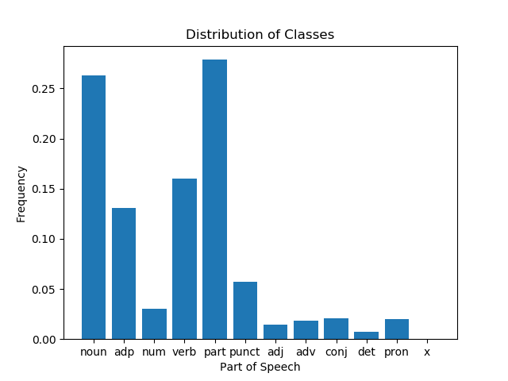
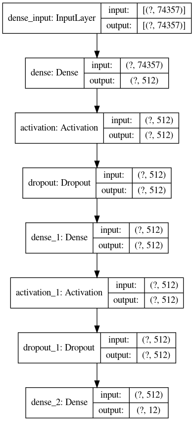
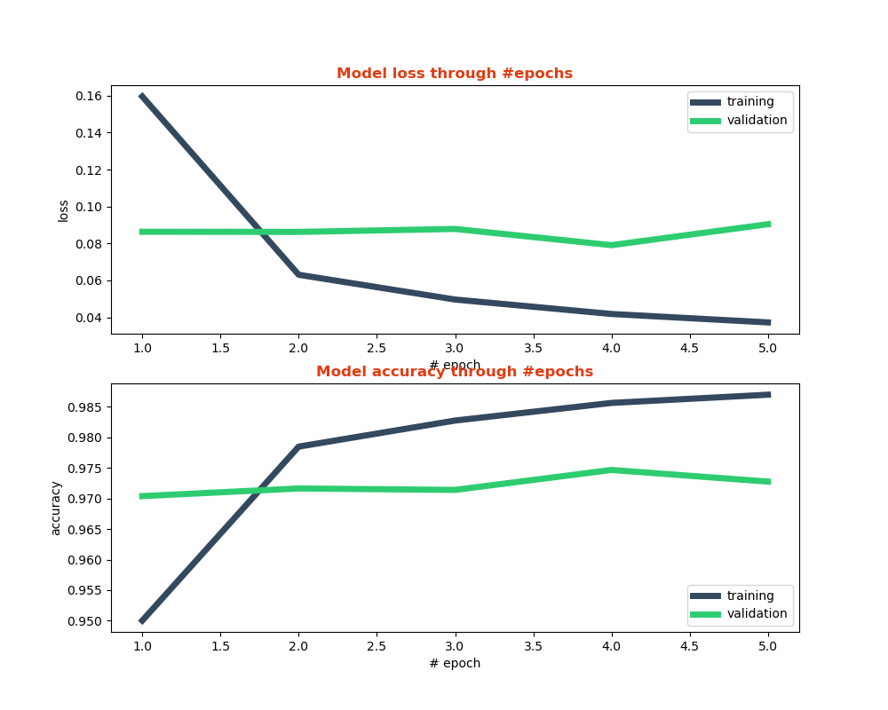
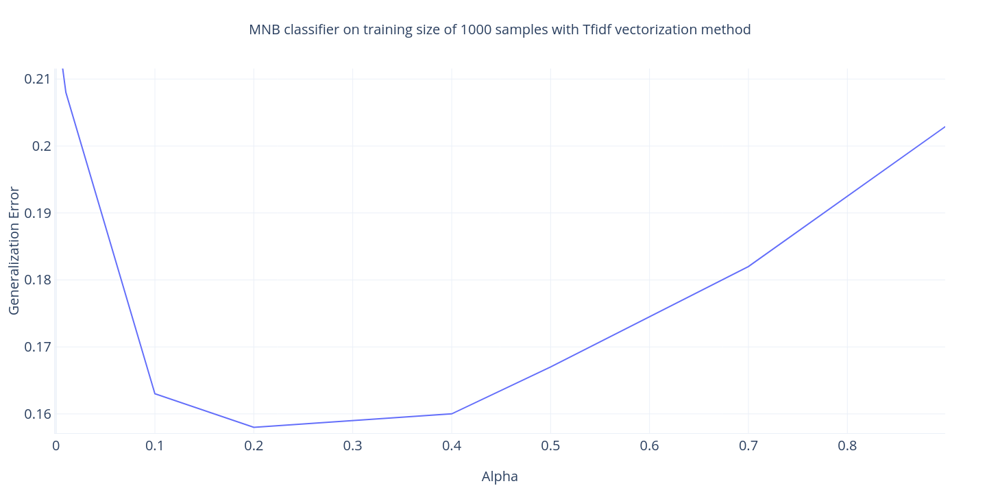
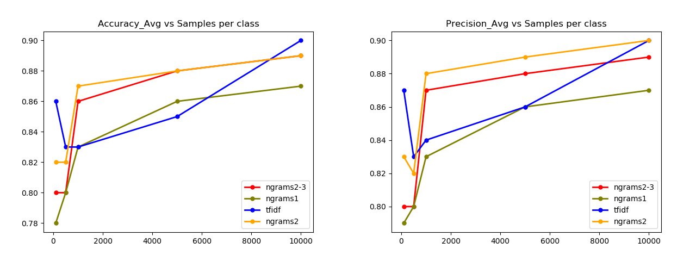
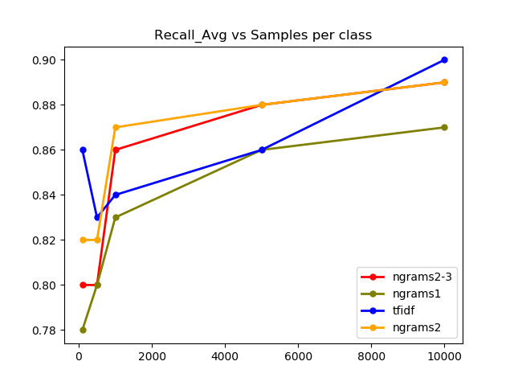
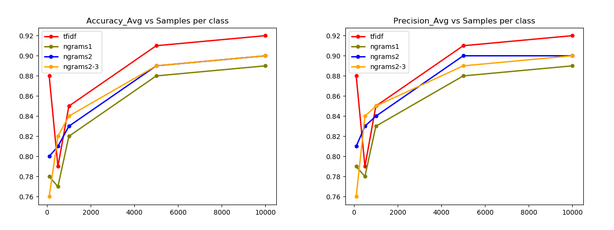
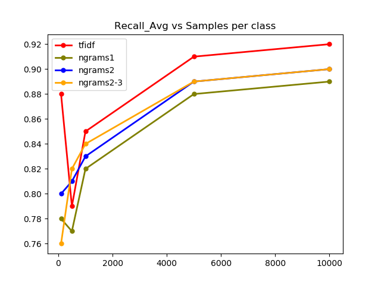
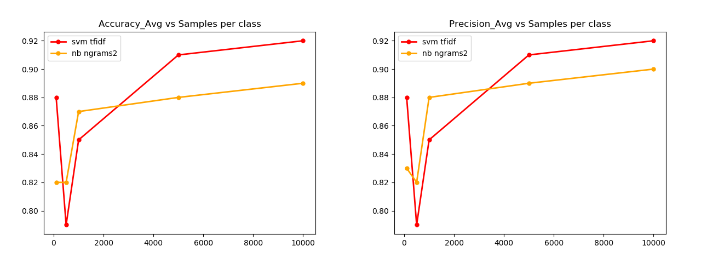
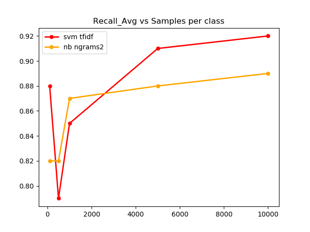

# ML EVALUATION MODELS

## Introduction

This project is divided into two sub-projects: Supervised learning on the Burmese Treebank parts of speech data and the compiled BBC data. This report provides a brief description for both sub-projects, the experimental setup, and the results that will be used in future to compare the performance against the Burmese BERT model.

#### Goal

We want to create a Burmese Bert model that would perform classification tasks on unseen data with high accuracy. To understand the accuracy of our BERT model, we need to compare it against the existing best models in the supervised learning domain. This is the strategy used by many researchers to evaluate the performance of the BERT models developed for other languages like French, Arabic, Dutch etc. I have compiled a document that lists the experimental procedures, data sources and general comments on research papers published for BERT models in other languages. This document can be found here [BERT reference](https://docs.google.com/document/d/1HzwSk0Na4hTtdre3Qz3WaWzJ4T1EaXyItUHPaYr1_pk/edit?usp=sharing "BERT reference").

This BERT model would later be used in our Social-Media Posts tracking system Aggie to identify instances of Hate Speech during the Myanmar elections in November 2020.


### Supervised learning on the Burmese Treebank data
------------

#### Problem Definition

Given a set of training data containing burmese sentences and Parts of Speech (PoS) annotations for each word in the sentence, design an efficient supervised learning model that predicts the PoS annotation of a word on test set based on learned patterns such as placement in the sentence, past usages, neighbors etc.

#### Data

The data for this experiment was obtained from [Burmese Treebank Data](http://www2.nict.go.jp/astrec-att/member/mutiyama/ALT/). This dataset contains 20,106 sentences with syntactic tree annotaions. For this experiment, only the Height 1 annotations from the syntactic tree were utilized as these annotations represented the PoS of a word in the tokenized sentence. More information on Height 1 syntactic annotations and the dataset can be found [here](https://dl.acm.org/doi/fullHtml/10.1145/3373268).
 The initial distribution of annotations in the original data is as follows:

<p align="center">
  

</p>
<p align="center">
<em>Figure 1. Intial class distribution</em>
</p>


As seen in the data, nouns, adpositions (adp), verb, and particles(part) cover about 80% of the tokens in the corpus[[1]](https://dl.acm.org/doi/fullHtml/10.1145/3373268). The presence of adjective(adj) tag is very sparse in the Height 1 annotations. We contacted our Burmese Language experts to provide some insight on why the presence  of the adjectives is so less considering how amply they are used in other languages and the reason was as follows: In Burmese, the adjective annotations make most sense when used to tag a combination of tokens(expressions) rather than tagging individual tokens. So at Height 1. where all annotations are at token-level, we do not see too many adjective annotations. 

**Preprocessing**

The preprocessing step involved creating a simpler JSON file containing each token and its annotation by removing the syntactic tree annotations present in the original data. This step ensured that only Height 1 token-level annotations are being used for the learning process. This JSON file can be found [here](). 


### Experiment
------------

We used supervised learning approach for this task of multi-class classification. We decided to use an Artificial Neural Network(ANN) for this PoS tag prediction task. The main reason for using Artificial Neural Network for this task of PoS tagging of Burmese tokens is because of the demonstrated success of RNNs(Recurrent Neural Network) and CNNs(Convolutional Neural Networks) in PoS tagging tasks in other languages like English, German [[2]](https://www.aclweb.org/anthology/L18-1446.pdf).

The high level design of the experiment includes separating the original dataset into training, validation and test data samples, adding additional features to each token such as the position in the sentence, vectorizing the training data with the added features using Dictionary Vectorizer[[3]](https://scikit-learn.org/stable/modules/generated/sklearn.feature_extraction.DictVectorizer.html), and supplying that vectorized transformed dataset to the artificial neural network. The ANN uses the training data samples to tune the neural network's weights and biases, validation data to get an estimate of model's performance while training, and the test dataset to get an unbiased estimate of the model's final perfomance. 

The distribution of the training, testing and validation set is shown in the Table 1.

| Dataset    | Size  |
|------------|-------|
| Training   | 16084 |
| Testing    | 4022  |
| Validation | 4021  |

Table 1. The distribution of the training, testing and validation set

#### Feature Engineering

For each token in our original dataset, we add additional features in a dictionary format to improve the performance of the ANN. These features include the position of the token in the sentence, left and right neighbors, prefixes and suffixes of the token, and the length of the sentence. The choice of these additional features is dependent on the structure of the language and can be arbitrary to some extent. Positional information of the token is important because most languages including Burmese contain a pattern where certain PoS tags occur at certain places in the sentence. Similarly, learning about the left and right neighbors also helps to generate a pattern to accurately predict the PoS tag of a token. Variations in performance in the presence and absence of these features will be discussed in the Results section. Figure [] shows the features that were added to each token in the code.

```python
{
  'nb_terms': len(sentence_terms),
  'token': token,
  'index': index,
  'is_first': index == 0,
  'is_last': index == len(sentence_terms) - 1,
  'prefix-1': token[0],
  'prefix-2': token[:2],
  'suffix-1': token[-1],
  'suffix-2': token[-2:],
  'prev_token': '' if index == 0 else sentence_terms[index - 1],
  'next_token': '' if index == len(sentence_terms) - 1 else sentence_terms[index + 1]
}

```
<p align="center">
<em>Figure []. Code snippet used to add features to each token before training.</em>
</p>


After feature engineering, each token with the additional features represented in the dictionary format as shown in Figure [] was vectorized using the DictVectorizer function [[3]](). The vectorized data was then used for the training of the ANN.


#### Neural Network Architecture

As mentioned earlier, we use an Artificial Neural Network(ANN) for the task of PoS tagging. This ANN consists of one input layer, two hidden layers, and one output layer. Each hidden layer is applied the ReLU activation function (Rectified Linear Unit). ReLU activation function yields "equal or better performance than hyperbolic tangent networks"[[4]](). Dropout layers are added after each hidden layers for regularization and avoiding overfiting. The dropout rate is set to 0.2. The softmax activation function is used on the output layer which is a standard choice for calculating a probability distribution over multiple classes in multi-class models[[5]](). The neural network architecture can be visualized in the Figure 2. The code snippet detailing the construction of neural network is shown in Figure 3.

<p align="center">
  

</p>
<p align="center">
<em>Figure 2. ANN visualization</em>
</p>

```python
model = Sequential([
        Dense(hidden_neurons, input_dim=input_dim),
        Activation('relu'),
        Dropout(0.2),
        Dense(hidden_neurons),
        Activation('relu'),
        Dropout(0.2),
        Dense(output_dim, activation='softmax')
    ])
    model.compile(loss='categorical_crossentropy', optimizer='adam', metrics=['accuracy'])

```
<p align="center">
<em>Figure 3. Code snippet used to generate the ANN shown in Figure 2.</em>
</p>

The size of each hidden layer is 512 neurons. The number of features in each token that is being supplied to the model is 74,357. The number of input samples supplied to the model is variable hence it's represented as "?" in the Figure []. The output layer produces a vector of size twelve which is the probability distribution over the twelve PoS tags. The entry with the highest probability represents the predicted PoS tag for the token.

#### Results

The ANN produced an overall average accuracy of 0.97, average precision of 0.96, and average recall of 0.94 across all 12 classes on the test dataset. The class-wise scores for precision and recall are reported in Figure []. 

```python
                  precision    recall  f1-score   support

         adj       0.97      0.88      0.92      2070
         adp       0.96      0.98      0.97     18332
         adv       0.97      0.94      0.96      2467
        conj       0.91      0.75      0.82      2932
         det       0.90      0.93      0.91       987
        noun       0.99      0.98      0.99     37207
         num       1.00      0.99      0.99      4426
        part       0.97      0.97      0.97     38559
        pron       0.96      0.98      0.97      2812
       punct       1.00      1.00      1.00      8009
        verb       0.96      0.99      0.98     21952

    accuracy                           0.97    139753
   macro avg       0.96      0.94      0.95    139753
weighted avg       0.97      0.97      0.97    139753

```
<p align="center">
<em>Figure 3. Classification metrics for the PoS task.</em>
</p>

As seen in the figure, the ANN model is very successful in identifying the punctuations in the text which is plausible since the punctuations have distinct representations and can only be labeled as punctuations. Same is true for the numbers classified by the model. The model is also very successful in classifying the nouns in the test dataset. We can also see that even though certain classes dominated the original dataset(nouns, adpositions, verb, and particles), the classifier does not suffer from the class imbalance problem. This can be explained by the fact that we have enough samples even for the infrequent class that the ANN is able to learn its intrinsic qualities and thus, successfully tagging the tokens belonging to that particular class in the test dataset.  

Figure [] shows the performance of the model on the validation set and the training set during the learning phase. The validation set is withheld during the training period and is only used at the end of every epoch to get an estimate of model's performance during the learning phase. As we can see, the accuracy on the validation set remains almost constant throughout the learning phase while the accuracy on the training set increases at each epoch. However, this is not enough to conclude that the ANN model is overfitting the training data because if that were the case, the accuracy on validation set would decrease and more importantly, the accuracy on the test dataset would not be so close to the accuracy of the training and validation set. Since the accuracies of training, validation, and test set align with eachother, we can safely conclude that the ANN model does not overfit but genuinely learns the intrinsic patterns associated with each class and uses those to make predictions on the test set.


<p align="center">
  

</p>
<p align="center">
<em>Figure []. The trend in accuracy and loss over training and validation set over five epochs during the learning phase</em>
</p>


#### Other interesting observations

I also trained the ANN over a different set of features associated with each token. Since each token is the smallest unit in Burmese language, using prefixes and suffixes of the token to improve the performance did not make much sense. Training the model without prefixes and suffixes did not change the accuracy/precision/recall of the model significantly as expected. 
However, adding information about the left and the right neighbors of a given token in the feature set significantly increased the performance of the model. This tells us that the neighboring tokens provide vital context to our model to determine the PoS of the given token at least in the Burmese language. 

Another interesting observation is how the validation set accuracy and loss stays almost constant during the five epochs. This tells us that even though our model is learning new patterns in the training set (as evidenced by the increase in the training set accuracy), there are certain nuances about the validation and test set that are not captured by the training set. These nuances could be that a certain word is used in multiple different contexts and is tagged with a different PoS tag everytime. From the analysis of the original dataset, Table [] shows some cases where a same word is tagged with multiple different PoS tags at different places in the original data. This can lead to the constant trend in validation set accuracy and loss especially if all the different usages of the same word are not captured enough times in the training set. The Table [] shows instances of tokens assigned either 4 or 5 different PoS tags. Further analysis shows that there are 103 tokens with 3 different PoS tags in the original data and 943 tokens with 2 different PoS tags. 

| Token        | PoS Tags                   |
|--------------|----------------------------|
| သည်          | adp, det, noun, part, pron |
| လေး          | adj, noun, num, part, verb |
| မ            | adj, adv, noun, part       |
| ပြီး, ရာ, ရင် | conj, noun, part, verb     |
| တိုင်း         | adp, noun, part, verb      |
| အောင်        | adj, conj, part, verb      |
| တချို့          | adj, det, noun, pron       |
| လိုက်          | adv, noun, part, verb      |

Table []. This table shows the tokens and the assigned tags in the original data.


#### Discussion

Overall, the ANN model performs exceptionally well on Burmese language Parts of Speech (PoS) tagging task. When comparing this performance against the novel Burmese BERT model, the main area to pay attention to is how well the Burmese BERT model is able to correctly identify PoS tags for tokens that are assigned three or more PoS tags in the original data depending on the context and its usage. 

#### Conclusion

We used supervised learning to create an Artificial Neural Network(ANN) to perform the task of Parts of Speech(PoS) tagging on the Burmese language. The model performed exceptionally well yielding an average accuracy of 97% with high precision and recall. We made interesting observations on why the accuracy and loss of the validation set stays constant after each epoch and provided a possible explanation for such trend. Future work in this area involves comparing the novel Burmese BERT model against the Neural Network and evaluating the differences in performance metrics of both the models. 


### Supervised learning on the Burmese BBC Data
------------

#### Problem Definition

Given a set of training data containing burmese BBC articles and their categories, design an efficient supervised learning model that predicts the category of the article based on learned patterns from the test dataset.

We also trained several classifiers using different vectorization methods and varying training sizes: `{200, 1000, 2000, 10000, All samples}` with almost equal samples per class (proportionate to sample count in the original data). The reason for creating classifiers for different training sizes is to figure out the crossover point where the Burmese BERT model starts to outperform the traditional ML classifiers.

#### Data

We used the Corpus Crawler tool to collect Burmese news articles from the Myanmar BBC website[[7]](). We collected a total of 24,787 articles dating back to 2009. However, the Corpus Crawler tool did not extract information about the category of the article. Hence, we edited the Corpus Crawler's script to also extract article's category along with the text. We will be releasing the BBC burmese article text and category data for public use. The news articles were categorized into one of the following categories:
```python
{
   "unknown":887,
   "articles":1,
   "burma":13696,
   "economy":110,
   "ethnic":38,
   "help":5,
   "in":353,
   "in_depth":1,
   "indepth":11,
   "institutional":120,
   "interactivity":183,
   "live":15,
   "media":113,
   "mobi_geno":3,
   "multimedia":810,
   "news":3431,
   "programmes":430,
   "services":3,
   "specials":19,
   "sport":488,
   "world":10493
}
```
<p align="center">
<em>Figure []. News article categories and counts</em>
</p>

As seen in Figure [], we can clearly notice that some classes like world and burma contain significantly more number of articles than other classes like media and programmes. Additionally, some web-links parsed by the corpus crawler do not even represent news articles like the ones contained in the "help" and "in" category. Certain news articles did not contain any category information, hence, those are included in the "unknown" category. Considering these issues, we narrowed down the number of classes to four containing burma, world, sports, and economy. The reasoning to choose these four categories for the classifier was that these categories are clearly distinct from one another and there is an informational value associated to classifying articles in these categories than the other categories present in the dataset.  

However, initial testing of the Support Vector Machine(SVM) and Naive Bayes(NB) classifier with optimal hyperparameters on the dataset containing these four categories revealed how severly the class imbalance issue was affecting the results. The results are displayed in the following figure.

```python
Num articles: 24787

classifier: Naive Bayes Classifier

              precision    recall  f1-score   support
       burma       0.83      0.92      0.88      2760
     economy       1.00      0.10      0.18        20
       sport       0.95      0.36      0.52       107
       world       0.85      0.77      0.81      2071

    accuracy                           0.84      4958
   macro avg       0.91      0.54      0.60      4958
weighted avg       0.84      0.84      0.84      4958

classifier: SVM Classifier

              precision    recall  f1-score   support
       burma       0.93      0.92      0.92      2760
     economy       0.88      0.35      0.50        20
       sport       0.86      0.63      0.72       107
       world       0.88      0.91      0.89      2071

    accuracy                           0.91      4958
   macro avg       0.89      0.70      0.76      4958
weighted avg       0.91      0.91      0.90      4958
```
<p align="center">
<em>Figure []. News article categories and counts</em>
</p>
As seen in Figure [], recall scores for economy and sports and extremely low for both classifiers. This results were not very useful for us since our goal to create a well-performing classifier that can effectively be compared against the Burmese BERT model that we plan to use. Since, having the economy and sports categories is not vital to our end goal and since the classifier's performance was not improving beyond this threshold, we decided to drop those two categories entirely to solve the class imbalance issue. 

Hence, the dataset that we used contains articles only belonging to the burma and the world categories. In the following sections, the term dataset refers to the collection of 24,189 "burma" and "world" articles.

#### Preprocessing

Preprocessing step included removing stop words, non-burmese text, and HTML tags from the parsed data[[9]](). We performed tokenization of the Burmese text by segmenting it using Myanmar Language Tool[[8]]().  

#### Feature Extraction

We used different strategies for vectorizing the input data before supplying that information to the classifiers. We used Term Frequency- Inverse Document Frequency (TfIdf) approach, unigrams, bigrams, trigrams, and combinations of those to achieve the best performance in our classifiers. Detailed analysis of which approach yielded the best results will be discussed in the Results section. 

Previous research has shown that N-gram language models perform well for Burmese segmentation tasks [[10]]. Following those results, we decided to explore how well n-grams vectorization approach along with an addtional Tfidf approach performs in Burmese classification task.


### Multinomial Naive Bayes

Naive Bayes ML models are widely used for text categorization problems because of the high computational efficiency achieved on high-dimensional problems [[12]](). We chose Multinomial NB (MNB) in particular, because of its proven high performance in NLP problems involving feature counts/fractional counts[[13]]().

#### Hyperparameters

We used the Cross Validation Grid Search to find the optimal hyperparameters[[11]](). The hyperparameters to fine-tune included the alpha value, which is the Laplace smoothing parameter. The range for the alpha value was selected using the standard practice to select optimal range based on the U-shaped generalization curve[[14]](). 

Example: For the following range of alpha `{0.001, 0.01, 0.1, 0.2, 0.4, 0.5, 0.7, 0.9, 1}` and Tfidf vectorization method on training size of 1000 samples, the generalization curve of the validation set is shown in Figure [].

<p align="center">
  

</p>
<p align="center">
<em>Figure 2. Graph showing generalization error for different alpha values</em>
</p>


The graph follows an almost "U shaped curve" showing that the optimal value for alpha lies in the selected range at the minima. For the MNB classifier trained on 1000 samples with Tfidf vectorization method, the optimal alpha value occurs when the generalization error is at minimum i.e. the minima on the graph where alpha = 0.2. The ranges for each classifier were adjusted similarly until the fairly U-shaped generalization error curve was obtained. 

The range of the alpha values tested were as follows: `{0.001, 0.01, 0.1, 0.2, 0.4, 0.5, 0.7, 0.9, 1}`. The best alpha value differed for each MNB classifier trained of varying number of samples and different vectorization approach. The optimal values in most cases were 0.2 and 0.4. 


#### Results

MNB classifier yielded the best results overall when all training samples were used. The vectorization scheme did not play a huge role in improving the performance of the model trained on larger training sets. For medium sized training sets (4000-12000 samples in this case), bigrams and a combination of bigrams and trigrams yielded the best results. The trends can be observed in the following figures.

<p align ="center">
  
</p>
<p align="center">
 
</p>
<p align="center">
<em>Figure []. Graphs showing the trend in average Accuracy, Precision, and Recall for different vectorization methods with increasing size of the training set. The X-axis shows the approximate number of training samples per class. </em>
</p>

#### Observations

We see that, generally, Ngrams approach outperforms Tfidf in MNB classifier for most sets of training sample sizes; however, Tfidf outperforms Ngrams either when all samples are used or the fewest samples are used i.e the left and right ends of the trends shown in Figure []. Tfidf assigns higher scores to terms that are used more rarely in the dataset, and often the ones which are more deterministic of the category the sample belongs to [[15]](). We observed that terms like တကသ, ခဏအက, ရန်ကုန်မြို့, ရစ, ကယ, မသ, တယ, အသက, ဆယ, တက, and ကန were assigned much higher scores compared to other terms. Many of these terms, when used in the right context, help the classifier in determining the category of the given article. For example, the word ရန်ကုန်မြို့(Yangon City), appears in 7 documents in total out of 200 randomly chosed training samples. When the model was tested on 47 unseen articles containing the word ရန်ကုန်မြို့, it yielded an accuracy score of 80.85%. This shows how few deterministic terms that appear consistently in the training set can improve the accuracy of the classifier even on smaller datasets when using Tfidf approach.

For medium sample sizes, the trends show that n-grams approach yields much better outcomes. This indicates that with increasing sample sizes, quantitative information on word combinations helps the classifier make better decisions than just using the Tfidf scores. This means that with increasing training size, the presence of deterministic terms across the training set increases, reducing/equalizing the overall Tfidf scores across several deterministic terms. At this point, the quantitative information on word combinationds derived from N-grams helps the classifier in better categorizing the BBC articles.

Also, the average accuracy, precision, and recall are fairly in sync with another indicating that the classifier is equally good at categorizing articles belonging to each class i.e. Burma and World in this case.  


#### Support Vector Machine

Support Vector Machines(SVM) usually outperform NB classifiers in text classification/categorization tasks; however, SVMs take extremely long time to find the optimal boundary for categorization purposes on high-dimensional problems such as this one. Training each SVM classifier using the entire training data for this problem took on average 3 hours on Georgia Tech PACE cluster with 12 nodes and 4 cores per node. SVMs did out perform MNB classifiers on larger training sets.  

#### Hyperparameters

We used the Cross Validation Grid Search to find the optimal hyperparameters[[11]](). The hyperparameters to fine-tune included the C value (regularization parameter), gamma (kernel coefficient), and kernel type. The ranges for each hyperparameter were as follows:
```python
C       : {0.01, 0.1, 1, 10, 100}
Gamma   : {0.01, 0.1, 1, 10}
Kernel  : {linear, rbf}
#The rbf kernel is the term used by scikit learn for Gaussian kernels.
```

All numerical ranges were selected using the "U-shaped" generalization error curve method. The polynomial kernel was left out because of the poor performance compared to the other two kernels revealed in the initial testing.


#### Results

The common hyperparameters that appeared in most of the SVM experiments with the combination of different training sizes and vectorization methods were as follows:

```python
C       : 10
Gamma   : 1
Kernerl : rbf 
```
As seen in Figure [], Tfidf seems to consistently outperform the Ngrams approach for almost all training sizes. 

<p align ="center">
  
</p>
<p align="center">
 
</p>
<p align="center">
<em>Figure []. Graphs showing the trend in average Accuracy, Precision, and Recall for different vectorization methods with increasing size of the training set. The X-axis shows the approximate number of training samples per class. </em>
</p>

#### Observations

As seen in the MNB case where Tfidf yields exceptionally high accuracy, precision and average for really small training sets, the same can be evidenced in the SVM classifiers with Tfidf yielding values higher than 85% for all three metrics on average. This means that for smaller training sets, Tfidf along with the optimal hyperparameter values helps in creating fairly separable data in a multi-dimensional space resulting in higher performance than that achieved by SVM on Ngrams with optimal hyperparameters on smaller training sets.

For training sets with samples more than 1000, Tfidf with optimal hyperparameters still seems to outperform Ngrams, however the difference is not very significant in this case. The average accuracies, precisions, and recalls are also in sync with each other for each training set size and vectorization approach. This indicates that the SVM classifier is equally good at predicting both Burma and World categories. 


#### Comparing SVM and MNB

Based on the individual performances of the classifiers as shows in previous sections, I decided to compare the MNB Ngrams vectorization and optimal hyperparameters with SVM Tfidf vectorization and optimal hyperparameters. For smaller training sets, SVM Tfidf with optimal hyperparameters performs better than its counterpart. This is largely because of the finding mentioned earlier about the exceptionally high performance of Tfidf on very small training sets in this classification problem. Overall, SVM outperforms MNB with a huge margin. This can be attributed to the fact that MNB makes a huge and often naive assumption about the independence of variables in calculating the probability of a sample belonging to a particular class. This provides significant time and computational advantage to MNB over other classifiers at the cost of accuracy to some extent. SVM is devoid of such huge assumptions because of which, it computionally extremely expensive. Doing a grid search for optimal hyperparameters for SVM with all training samples took approximately 3 hours on Georgia Tech PACE cluster with 12 nodes and 4 cores per node. However, SVMs yielded consistent and higher performance scores than the MNB classifier.

<p align ="center">
  
</p>
<p align="center">
 
</p>
<p align="center">
<em>Figure []. Graphs comparing the trend in average Accuracy, Precision, and Recall for different vectorization methods with increasing size of the training set between SVM and MNB classifiers. The X-axis shows the approximate number of training samples per class. </em>
</p>

#### Future work

The main goal of this project is to analyze the performances of traditional supervised learning models on the Burmese Parts of Speech data and the compiled Burmese BBC news articles data. This analysis will be used as a reference point to compare the performance of the modern Burmese BERT model developed by our lab. The research goal for this comparison between traditional ML algorithms with novel BERT model is to identify the advantages of using Burmese BERT model for various NLP classification tasks like hate-speech detection. We anticipate that there is a crossover point when the novel Burmese BERT model starts to outperform classical ML algorithms on various NLP problems with consistently increasing sizes of the training sets.


#### Conclusion

In this report, we dived deep into the design decisions and practices used to create each classifier for both problems of PoS tagging and BBC news articles classification. We identified the importance of context and the inability of ANNs to learn context in the PoS tagging task. We presented the variations in the performance of SVMs and MNBs on varying training set sizes and vectorization methods. We discovered and justified the exceptionally high performance on unseen data gained while using Tfidf approach on both SVM and MNB classifiers with optimal hyperparameters trained on very small trainings sets. Lastly, we also compared SVM with MNB to gain an idea of the advantages and the disadvantages of using one over the other. 


References:

1) https://dl.acm.org/doi/fullHtml/10.1145/3373268
2) https://www.aclweb.org/anthology/L18-1446.pdf
3) https://scikit-learn.org/stable/modules/generated/sklearn.feature_extraction.DictVectorizer.html
4)  Xavier Glorot, Antoine Bordes, Yoshua Bengio ;
Proceedings of the Fourteenth International Conference on Artificial Intelligence and Statistics, PMLR 15:315-323, 2011. 
5) https://arxiv.org/pdf/1811.03378.pdf
6) Code credits: https://becominghuman.ai/part-of-speech-tagging-tutorial-with-the-keras-deep-learning-library-d7f93fa05537
7) https://github.com/google/corpuscrawler
8) https://github.com/MyanmarOnlineAdvertising/myanmar_language_tools
9) https://github.com/HtooSayWah/Cyberbullying-System
10) https://dl.acm.org/doi/abs/10.1145/2846095
11) https://scikit-learn.org/stable/modules/generated/sklearn.model_selection.GridSearchCV.html
12) https://link.springer.com/chapter/10.1007/978-3-540-30549-1_43
13) https://scikit-learn.org/stable/modules/generated/sklearn.naive_bayes.MultinomialNB.html
14) Goodfellow, Ian, Yoshua Bengio, and Aaron Courville. Deep learning. MIT press, 2016.
15) Aizawa, Akiko. "An information-theoretic perspective of tf–idf measures." Information Processing & Management 39.1 (2003): 45-65.


